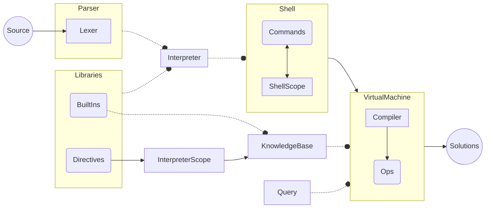

# Architecture

The shell is the top-level interactive Ergo environment.
It manages parsing, interpreting, compiling, debugging and executing code through its various commands.

The interpreter is the fulcrum of the architecture. It is necessary in order to create a knowledge base, and it can be used without a shell.
It's extended through libraries, which export built-ins and directives, and handle Ergo events.

The virtual machine is the engine that's actually responsible for answering queries against the knowledge base.
It also handles compilation, though most of it actually happens automatically through events.

All layers of the architecture can be extended by implementing the corresponding Command, Directive, BuiltIn or Op.

# New Architecture

